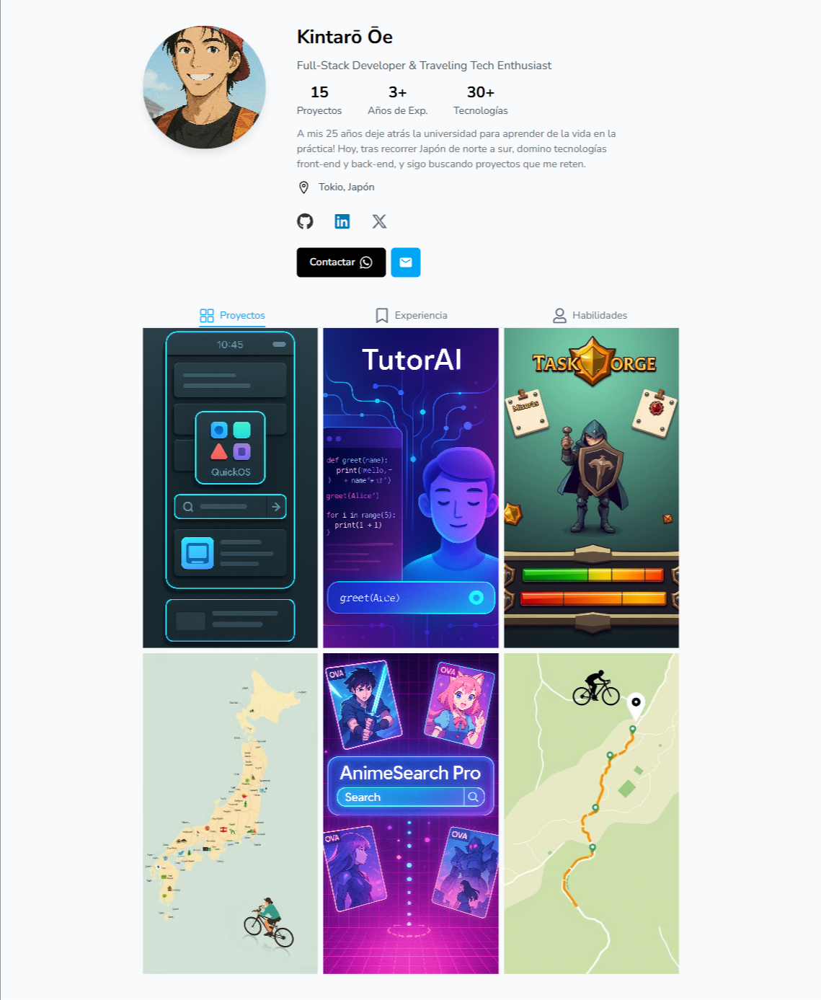
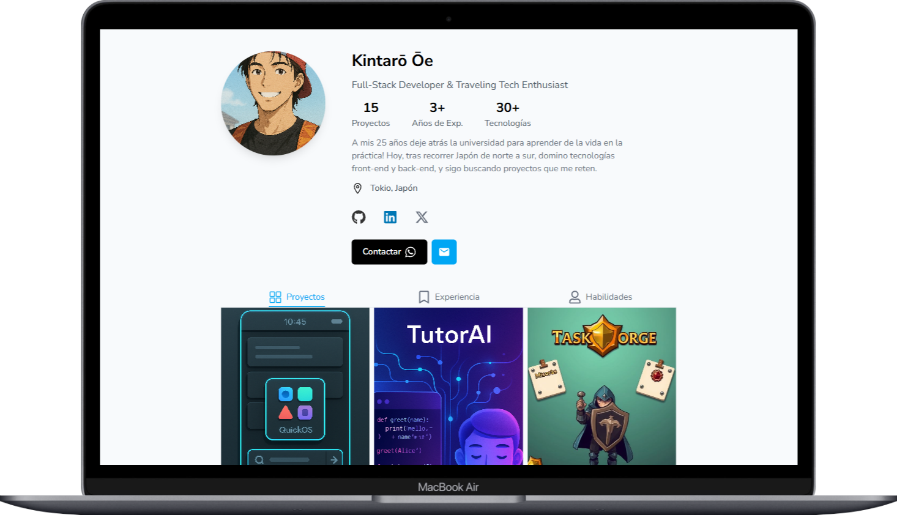
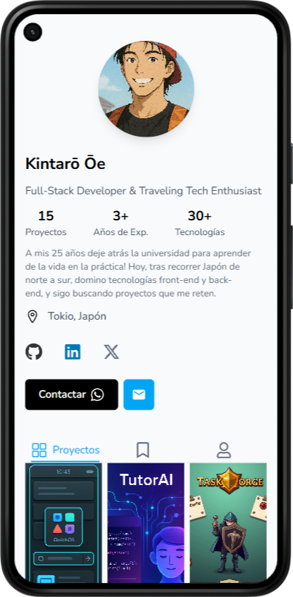

# Portafolio de Kintarō

Este portafolio no es solo un sitio web: es una representación visual y técnica del espíritu curioso, adaptable y autodidacta de **Kintarō Ōe**, el protagonista de *Golden Boy*. Así como el personaje se enfrenta a distintos trabajos y siempre logra destacar, este proyecto refleja la evolución, versatilidad y pasión por aprender de un desarrollador Full-Stack moderno.


<!--  -->

<!--  -->

<div align="center">
  
  
</div>

## 🧠 Inspiración

> “¡La vida es el mejor maestro!” – Kintarō Ōe

El diseño del portafolio toma inspiración de:
- La estética dinámica y limpia de redes sociales como Instagram.
- La adaptabilidad de Kintarō, quien aprende rápidamente y resuelve problemas con creatividad.
- La idea de que cada experiencia (como cada proyecto aquí mostrado) forma parte del viaje de crecimiento personal y profesional.

## 📌 Funcionalidades Principales

- 🧑‍💼 Perfil con información de contacto
- 🖼️ Cuadrícula de proyectos con vistas detalladas en modales
- 🕒 Línea de tiempo de experiencia tipo storytelling
- 🧠 Sección de habilidades técnicas
- 📱 Diseño 100% responsivo para cualquier dispositivo


## 🛠️ Tecnologías Utilizadas

- **Framework Frontend**: React con TypeScript
- **Herramienta de Construcción**: Vite
- **Estilos**: Tailwind CSS
- **Iconos**: React Icons
- **Gestión de Estado**: React Hooks (useState)

## 🏗️ Estructura del Proyecto

```plaintext
src/
├── components/             # Componentes de UI
│   ├── Header.tsx          # Encabezado del perfil
│   ├── Navigation.tsx      # Navegación por pestañas
│   ├── GridProjects.tsx    # Cuadrícula de proyectos
│   ├── ModalProject.tsx    # Detalles de proyecto
│   ├── GridExperience.tsx  # Línea de tiempo
│   ├── GridSkills.tsx      # Habilidades técnicas
│   └── index.ts            # Exportador de componentes
├── constants/              # Información estática del portafolio
│   └── index.tsx
├── types/                  # Tipado global
│   └── index.ts
├── App.tsx                 # Componente raíz
└── main.tsx                # Punto de entrada
```

## 🚦 Primeros Pasos

### Instalación

1. Clona el repositorio:
2. Instala las dependencias:

```bash
bun install
```

3. Inicia el servidor de desarrollo:

```bash
bun dev
```
4. Abre tu navegador en la dirección:
`http:localhost:3000`

## 🎨 Personalización

Para adaptar el portafolio a tu perfil:

- Modifica tu información personal en `src/constants/index.ts`
- Sustituye las imágenes en `public/presentacion/`
- Ajusta los colores en la configuración de Tailwind
